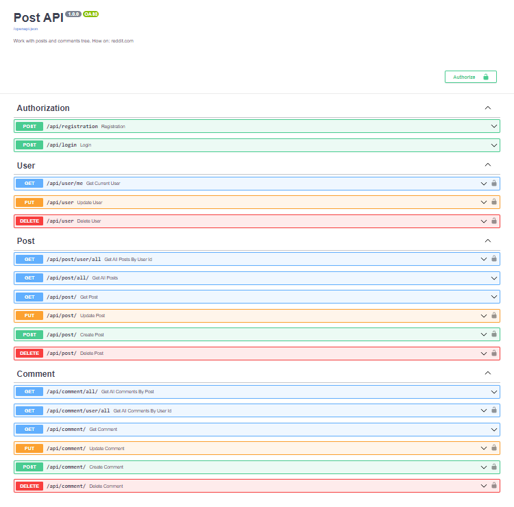

# Post API

Work with posts and comments tree. How on: reddit.com


## Setup:
> ```shell
> # SSH
> git clone git@github.com:xristxgod/POST-API.git
> # HTTPS
> git clone https://github.com/xristxgod/POST-API.git
> ```


## Settings in .env file:
> `DATABASE_URL` - The url from the database, both postgres and sqlite3 are allowed.
> 
> `JWT_SECRET` - The secret key
> 
> `JWT_ALGORITHM` - Algorithm for encryption


## How to run:
> ```shell
> # Create db
> python create_db.py
> # Run
> docker-compose -f docker-compose.yml up --build
> # Stop
> docker-compose -f docker-compose.yml stop
> ```


## Screenshot API:

